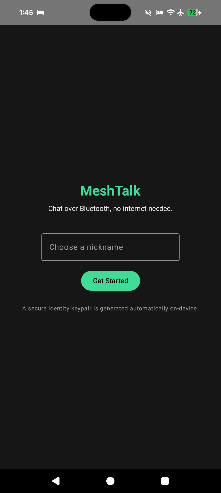
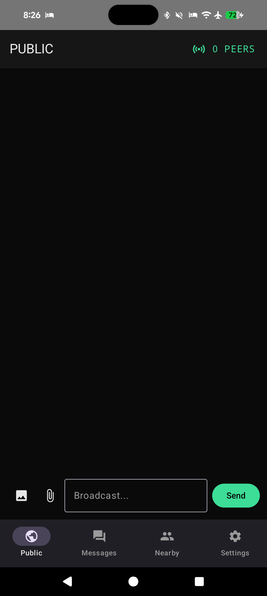
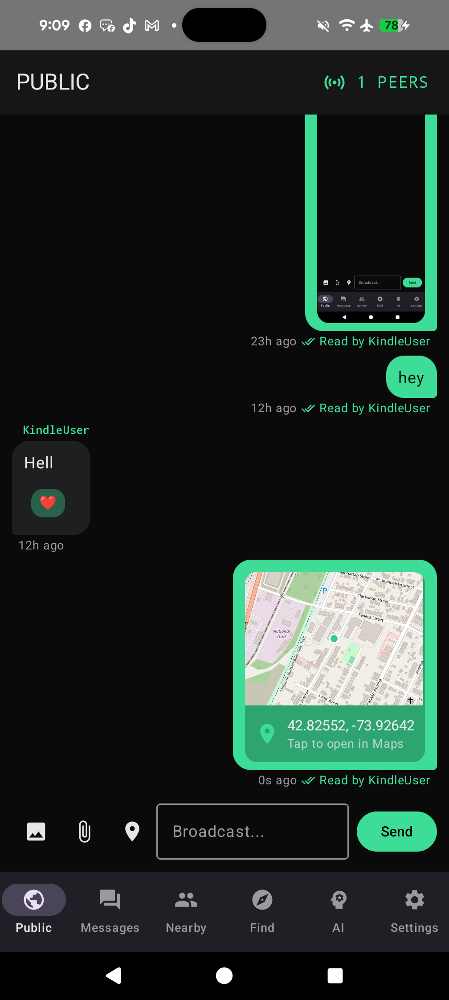
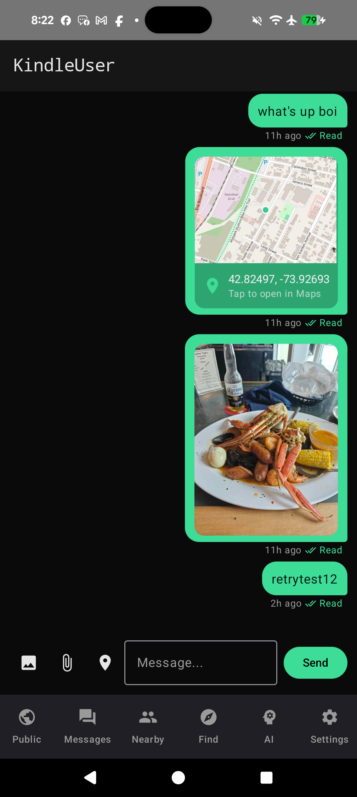
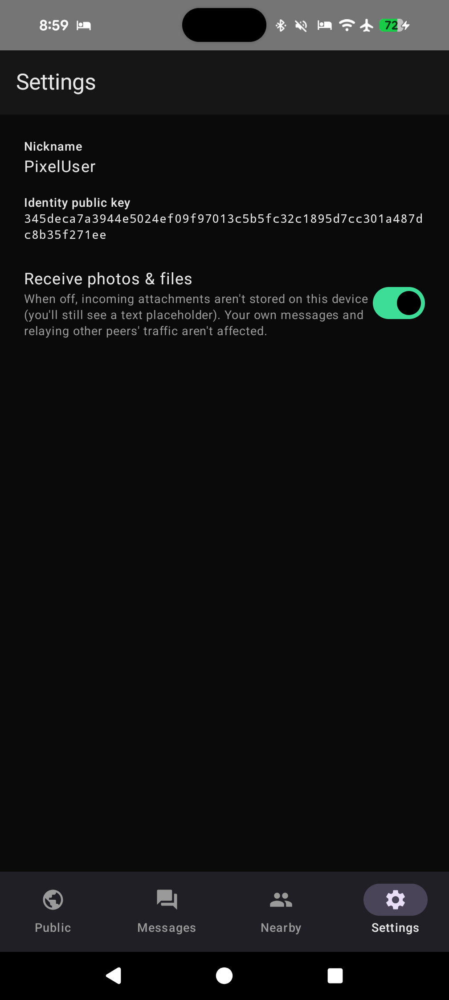
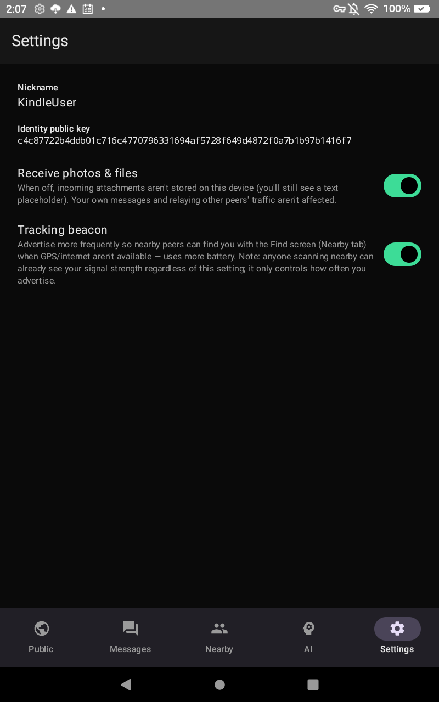
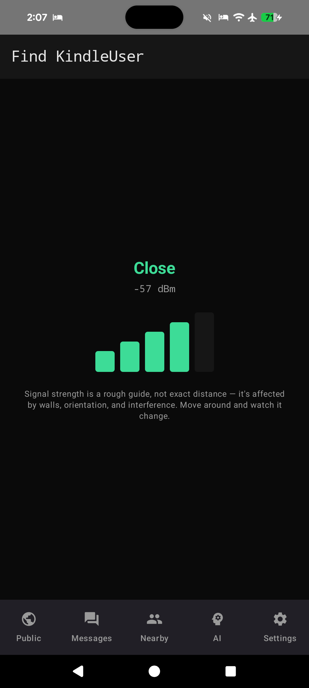
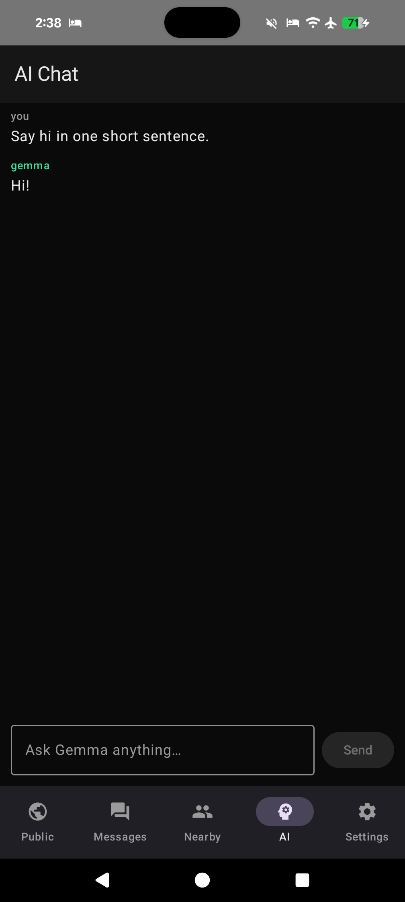

# MeshTalk

MeshTalk is a native Android chat app that talks over Bluetooth Low Energy (BLE) instead of the internet. Nearby phones running the app find each other automatically — no pairing, no accounts, no server — and relay messages through each other to reach further than a single Bluetooth hop.

📄 [Privacy Policy & project site](https://chartmann1590.github.io/bluetooth-chat/)

## Features

- **No pairing required** — phones advertise and scan for each other over BLE and exchange messages over transient GATT connections.
- **Mesh relay** — messages hop through other nearby phones (TTL-limited) to extend range beyond direct Bluetooth distance, with store-and-forward for peers who are briefly out of range.
- **Public feed** — a broadcast channel visible to everyone currently on the mesh.
- **Encrypted DMs** — private messages are end-to-end encrypted (X25519 key exchange + AES-GCM) and signed (Ed25519), so only the intended recipient can read them.
- **Photos & files** — send a compressed photo or a small file inline, in both the public feed and DMs. A per-user setting lets you turn off receiving attachments entirely (you still relay them for the rest of the mesh, you just don't store/display them locally).
- **Background operation** — a foreground service keeps the mesh alive when the app isn't in the foreground, with an optional battery-optimization exemption for reliability.
- **DM notifications** — get notified when a new direct message arrives while you're not looking at that conversation; tapping the notification opens the thread.
- **Read receipts** — sent messages show a "Read" checkmark once the recipient (DM) or any peer (public feed, listing who) has opened it.
- **Location sharing** — share your current coordinates with a best-effort static map thumbnail (fetched once at send time, then carried over the mesh like a photo — no internet needed to view it after that); falls back to coordinates + "open in Maps" if no connectivity was available when sending.
- **Typing indicators** — see "so-and-so is typing…" live in both the public feed and DM threads (ephemeral over-the-mesh signal, never stored or replayed to peers who reconnect later).
- **On-device AI chat** — a private, fully-offline chat with Google's Gemma 4 model running locally via [LiteRT-LM](https://ai.google.dev/edge/litert), Google AI Edge's on-device LLM runtime. One-time ~2.6GB download, then works with zero connectivity forever after; nothing typed here ever goes over the mesh. Uses the on-device GPU delegate when available, falling back to CPU automatically.
- **Bluetooth proximity finder** — when GPS and internet are both unavailable, find a nearby contact by raw Bluetooth signal strength (RSSI): a live signal-strength gauge and "Very close" → "Very far" estimate. Requires the other person to have their "Tracking beacon" enabled in Settings (which just advertises more frequently — anyone scanning can already see raw signal strength regardless).

## Screenshots

<table>
<tr>
<td><br><sub>Onboarding</sub></td>
<td><br><sub>Background reliability prompt</sub></td>
<td><br><sub>Public feed: location + read receipt</sub></td>
</tr>
<tr>
<td><br><sub>DM thread: read receipt</sub></td>
<td><br><sub>Settings</sub></td>
<td><br><sub>Typing indicator</sub></td>
</tr>
<tr>
<td><br><sub>Tracking beacon toggle</sub></td>
<td><br><sub>Find: Bluetooth proximity</sub></td>
<td><br><sub>On-device AI chat (Gemma 4)</sub></td>
</tr>
</table>

## How it works

Every phone runs both BLE roles at once:

- **Peripheral**: advertises a custom GATT service and accepts incoming connections/writes.
- **Central**: scans for other phones advertising that service and connects to them.

Packets are signed, optionally encrypted, fragmented to fit the negotiated BLE MTU, and reassembled on the other end. Each packet carries a TTL; relay nodes decrement it and re-broadcast until it reaches zero, with a dedup cache preventing loops. See `app/src/main/java/com/charles/meshtalk/app/ble/` for the protocol implementation.

Because real-world BLE throughput is roughly 1–3 KB/s in this design, photos are automatically downscaled/recompressed and generic files are capped at a small size — large transfers are much more likely to span a connection drop than short ones, and there's no resume-on-failure.

Typing indicators reuse the same signed-packet mesh transport as everything else, just with a short TTL and a separate ephemeral dedup cache — they're never persisted or replayed to a peer that reconnects later. The Bluetooth proximity finder reads the RSSI (signal strength) BLE already reports for each nearby advertiser and maps it to a rough "how close" estimate; it doesn't use GPS at all, so it keeps working with location services and mobile data both off. The on-device AI chat is a separate, local-only feature — it downloads and runs Google's Gemma 4 model directly on the phone via LiteRT-LM, and nothing typed into it is ever sent over the mesh or the internet after the initial model download.

## Requirements

- Android device with Bluetooth LE support (minSdk 26)
- Two or more devices to actually test mesh communication — BLE can't be emulated, so this needs real hardware

## Building

```bash
./gradlew assembleDebug
adb install -r app/build/outputs/apk/debug/app-debug.apk
```

## Project structure

```
app/src/main/java/com/charles/meshtalk/app/
├── ai/             On-device Gemma 4 model manager (download, load, inference via LiteRT-LM)
├── ble/            BLE mesh transport: service, packet codec, mesh relay engine
├── crypto/         Identity keypair, signing, ECDH + AES-GCM
├── data/           Room database (contacts, messages)
├── media/          Image compression, file size/type validation
├── notifications/  DM notification channel
├── repository/     Bridges the BLE service + Room to the UI
└── ui/             Jetpack Compose screens
```

## Known limitations

- Peer counts can transiently show one higher than the number of physical devices right after a fresh connection, until each link's identity announcement is exchanged (BLE address rotation means one phone can briefly appear as two connections).
- No delivery confirmation or retry for failed sends — mesh messaging is best-effort.
- Attachments are capped small by design; video isn't supported.
- The static map thumbnail for a shared location requires the sender to have internet connectivity at the moment they share it; the coordinates and "open in Maps" fallback always work regardless.
- The on-device AI model is a one-time ~2.6GB download and needs a reasonably capable device (8GB+ RAM recommended) to run well; it's a separate local feature and isn't part of the mesh protocol.
- Bluetooth signal strength is a rough distance proxy, not exact — walls, orientation, and interference all affect it. Anyone scanning nearby can see a device's raw signal strength; the "Tracking beacon" setting only controls how often that device advertises, not whether its signal is visible.
